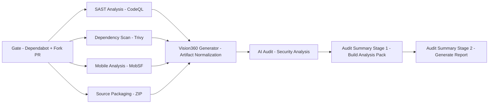

# 🚀 mSEC-AM (mobile SECurity Audit Method)


> **Scan, analyze and generate AI-powered security reports for Android apps in a single pipeline.**  
> Automated DevSecOps pipeline combining SAST, MobSF, Trivy and AI-driven analysis.

## 🧠 Overview

**mSEC-AM** is a security auditing system for Android applications that integrates multiple analysis tools into a unified pipeline.

It combines:

- 🔍 Static analysis (SAST / CodeQL)
- 📱 Mobile analysis (MobSF)
- 📦 Dependency vulnerability scanning (Trivy)
- 🤖 AI-driven post-processing and reporting

### 🤖 AI-driven analysis
- Correlates findings across multiple tools
- Generates human-readable security reports
- Produces structured JSON for LLM-based pipelines

👉 The goal is to **automate security auditing and generate structured outputs for further analysis (including LLM-based systems).**

> ⚠️ **Legacy Android projects:** Some older projects may fail to build in CI due to outdated repositories or dependencies (for example, `jcenter`/Bintray-based artifacts or very old Google Play Services versions). In such cases, repository migration or dependency updates may be required before mobile analysis can run successfully.


## 💡 Why mSEC-AM?

- Fully automated Android security auditing pipeline
- Combines static, dynamic, and dependency analysis
- AI-ready outputs for advanced security analysis
- Designed to integrate directly into existing Android projects


## 📋 Prerequisites

- Java 17
- MobSF (Mobile Security Framework) ≥ 4.5
- Python 3 (for MobSF)
- Android SDK (compatible with the target project)
- Android Emulator (API 29, AOSP image)
- ADB tools (adb)
- MobSF server running and accessible
- GitHub self-hosted runner (required for MobSF dynamic analysis)


### 🎥 Configuration & Demo Video

Watch a single video covering installation, configuration, and a demo of the application:


[](https://youtu.be/PY3NXN5IN8Y)


## ⚙️ How it works

The system orchestrates several workflows:

1. **SAST Analysis (CodeQL)**  
   Performs static code analysis to identify security vulnerabilities and code quality issues.

2. **Mobile Analysis (MobSF)**  
   Executes static and dynamic analysis of the Android application, including runtime behavior using an emulator.

3. **Dependency Scanning (Trivy)**  
   Scans project dependencies to detect known vulnerabilities in third-party libraries.

4. **Aggregation & AI Payload Generation (VISION360)**  
   Normalizes and aggregates results from all tools into a unified structure, generating an AI-ready payload for further analysis.


Each stage produces artifacts that are later combined into a unified report.


## 📂 Project Structure

```text
mSEC-AM/
├── .github/
│   └── workflows/        # CI/CD security pipelines
├── scripts/              # Audit processing and report generation
└── README.md
```


## 🔄 Pipeline Architecture

The following diagram shows the complete security audit pipeline orchestrated by **mSEC-AM**:




### 🖥️ Supported host operating systems

- **Windows**

> ⚠️ **Important:** The pipeline requires a Windows environment due to dependencies on the Android emulator and MobSF dynamic analysis.


## 🚀 Quick Start

1. Copy `.github/` and `scripts/` into your Android project root
2. Configure GitHub Secrets and Variables
3. Set up MobSF and Android Emulator
4. Push your code to trigger the pipeline

👉 The security report will be generated automatically as a GitHub artifact.


## 🎯 Use Cases

- Security auditing in CI/CD pipelines
- Academic research in mobile security
- Automated vulnerability reporting
- Pre-release security validation for Android apps

## 📊 Output

After execution, the pipeline generates:

- 📄 Security report (PDF)
- 📄 Security report (DOCX)

🔎 Example reports (real pipeline output):

- 📄 [View sample PDF report](https://github.com/investigaciongiis/openMRS/raw/refs/heads/main/reports/Audit%20Summary.pdf)
- 📄 [View sample DOCX report](https://github.com/investigaciongiis/openMRS/raw/refs/heads/main/reports/Audit%20Summary.docx)


All outputs are available as GitHub Actions artifacts.

---

## ⚠️ Known limitations

- Some legacy Android projects may fail to build in CI due to outdated dependencies (e.g., `jcenter`, old Google Play Services).
- Dynamic analysis requires a running Android emulator with writable system.
- MobSF must run locally and cannot be containerized when using dynamic analysis.


## 🔧 Integration into an Android Project

To use **mSEC-AM** in your Android repository:

### 📁 1. Clone and copy required directories

Clone the repository and copy the following folders into your Android project root:

```text
.github/
scripts/
```

Your project must look like:

```
your-android-project/
├── .github/
├── scripts/
├── gradlew
├── gradlew.bat
├── build.gradle / build.gradle.kts
├── settings.gradle / settings.gradle.kts
└── ...
```


> ⚠️ **Important:** The repository must include `gradlew` (and `gradlew.bat`). The pipeline depends on them to resolve dependencies and build the APK.  
> Ensure these files are committed to the repository and **not excluded by `.gitignore`**.

### ⚙️ 2. Customize report metadata

Edit the following file:

```text
scripts/audit_summary_literales.json
```

This file allows you to customize:

application metadata
report header and cover page
audit actors and contributors

🧾 Template
````
{
  "app_metadata": {
    "Name": "",
    "Developer": "",
    "Category": "",
    "Supported platforms": "",
    "Version": "",
    "Last update": "",
    "Compatible idioms": "",
    "Source": "",
    "License": "",
    "Main language": ""
  },
  "actors": {
    "Auditor": "",
    "Requirement Engineering team": [
      ""
    ],
    "Engineering Group (EN)": [
      ""
    ]
  },
  "header_text": "",
  "cover_page_text": ""
}
````

✅ Example

```
{
  "app_metadata": {
    "Name": "OpenMRS",
    "Developer": "Openmrs.org",
    "Category": "Mobile Health (mHealth) / EMR Client",
    "Supported platforms": "Android (SDK 19-33+)",
    "Version": "3.1.2",
    "Last update": "31/03/2026",
    "Compatible idioms": "English",
    "Source": "Open source",
    "License": "MPL-2.0",
    "Main language": "Java + Kotlin + XML + Groovy"
  },
  "actors": {
    "Auditor": "Juan José López Jiménez",
    "Requirement Engineering team": [
      "Carlos M. Mejía-Granda",
      "José L Fernández-Alemán",
      "Juan Manuel Carrillo-de-Gea",
      "Joaquín Nicolás",
      "Juan José López Jiménez"
    ],
    "Engineering Group (EN)": [
      "Carlos M. Mejía-Granda",
      "José L Fernández-Alemán",
      "Juan Manuel Carrillo-de-Gea",
      "Joaquín Nicolás",
      "Juan José López Jiménez"
    ]
  },
  "header_text": "OpenMRS Android Client v3.1.1",
  "cover_page_text": "OpenMRS Android Client - v3.1.1"
}
```

## 📱 3. MobSF Setup (Required for Mobile Analysis)

mSEC-AM requires a running **MobSF (Mobile Security Framework)** instance to perform mobile application analysis.

> ⚠️ **MobSF setup requirement:**  
> MobSF must be fully installed with all its dependencies before running the pipeline.  
> Refer to the official MobSF documentation for installation steps and system requirements.

> ⚠️ **Important:** MobSF must be installed and executed locally using `setup.bat`.  
> **Docker** is not supported, as dynamic analysis requires direct access to the Android emulator.

### 🛠️ Install MobSF

Clone the official repository:

```bash
git clone https://github.com/MobSF/Mobile-Security-Framework-MobSF.git
cd Mobile-Security-Framework-MobSF
```

Installation:
```bash
setup.bat
```

### ▶️ Run MobSF

Start the MobSF server:

```bash
run.bat
```

MobSF will be available at:

```bash
http://localhost:8000
```

### 🔐 Access MobSF Web Interface

Open your browser and navigate to:

```bash
http://localhost:8000
```

You should see the MobSF dashboard.

### 🔑 Obtain the API Key

To integrate MobSF with the pipeline, you need an API key:

Option 1 – From the MobSF console:

1. When MobSF is started (run.bat), the API key is displayed in the console output
2. Copy the API key from the terminal


Option 2 – From the MobSF web interface:

1. Go to the MobSF web interface
2. Click on “Settings” (top menu)
3. Locate the API Key section
4. Copy the API key


Finally, store the API key as the MOBSF_API_KEY repository secret in GitHub.


### 🔐 4. Configure GitHub Secrets and Variables

Go to:

```text
Repository → Settings → Secrets and variables → Actions → Secrets
```

#### 🔑 Secrets

Navigate to:

```text
Secrets → New repository secret
```

Create the following:

| Name                      | Description                                      |
| ------------------------- | ------------------------------------------------ |
| `ANDROID_KEYSTORE_BASE64` | Base64-encoded Android keystore used for signing |
| `KEYSTORE_ALIAS_NAME`     | Alias name of the keystore                       |
| `KEYSTORE_ALIAS_PASS`     | Password of the keystore alias                   |
| `KEYSTORE_PASSWORD`       | Password of the keystore                         |
| `LLM_API_KEY`             | API key used to access the LLM service           |
| `MOBSF_API_KEY`           | API key used to authenticate with MobSF          |

#### 🔐 Android Keystore Setup

If your project does not already have a keystore, generate one:

```bash
keytool -genkey -v -keystore release.keystore -alias my-key-alias -keyalg RSA -keysize 2048 -validity 10000
```

Convert it to Base64:

```bash
[Convert]::ToBase64String([IO.File]::ReadAllBytes("release.keystore")) | Out-File "keystore.base64"
```

Copy the content of the generated file into:

ANDROID_KEYSTORE_BASE64


#### ⚙️ Variables

Navigate to:

```text
Variables → New repository variable
```

Create the following:

| Name                                | Description                                                      | Example                                                      |
| ----------------------------------- | ---------------------------------------------------------------- | ------------------------------------------------------------ |
| `LLM_BASE_URL`                      | Base URL of the LLM service                                      | `https://api.openai.com/v1`                                  |
| `LLM_MODEL`                         | Model identifier used by the LLM                                 | `gpt-5.4`                                                    |
| `ENABLE_CODE_SCANNING_UPLOAD`       | Enable CodeQL results upload (optional)                          | `false` (default)                                            |
| `MOBSF_DELETE_BEFORE_SCAN`          | Clean previous MobSF scans (optional)                            | `true` (default)                                             |
| `MOBSF_BASE_URL`                    | MobSF server URL (optional)                                      | `http://localhost:8000` (default)                            |
| `MOBSF_DELETE_ENDPOINT`             | MobSF delete API endpoint (optional)                             | `http://localhost:8000/api/v1/delete_scan` (default)         |
| `ANDROID_BUILD_CMD`                 | Custom Gradle command used to build the Android APK (optional)   | `.\gradlew.bat --no-daemon clean assembleRelease` (default)  |
| `ENABLE_GRADLE_LOCKFILE_GENERATION` | Enables optional Gradle lockfile generation (optional)           | `true` (default)                                             |
| `USE_PREBUILT_APK`                  | Use an existing APK instead of building the project (optional)   | `false` (default)                                            |
| `PREBUILT_APK_PATH`                 | Path to the prebuilt APK file (optional)                         | `apk/app-release.apk` (default)                              |


> ⚠️ **LLM Configuration:**  
> The pipeline requires a valid LLM endpoint to generate AI-based analysis.  
>
> For best results, it is recommended to use OpenAI ChatGPT models.  
> Alternatively, you can configure a custom LLM endpoint via `LLM_BASE_URL` and `LLM_MODEL`.
>
> ⚠️ **Important:** For repositories not owned by an organization, set `ENABLE_CODE_SCANNING_UPLOAD` to `false`.  
> For organization-owned repositories, ensure that the **Security Policy** is properly configured under **Security & Quality → Overview**.
> 
> When enabled, the pipeline uploads CodeQL analysis results to GitHub Code Scanning.  
> Detected vulnerabilities will appear in the repository’s **Security** tab, allowing developers to review, triage, and track security issues directly within GitHub.
>
> ℹ️ **MobSF Configuration:**
> The pipeline communicates with a running MobSF instance via its REST API.
>
> - `MOBSF_BASE_URL`: Base address of the MobSF server  
>   *(default: `http://localhost:8000`)*
> - `MOBSF_DELETE_ENDPOINT`: API endpoint to delete previous scans  
>   *(default: `http://localhost:8000/api/v1/delete_scan`)*
> - `MOBSF_DELETE_BEFORE_SCAN`: Deletes previous scans for the same APK hash  
>   *(enabled by default)*  
>
> This helps avoid duplicate entries and ensures consistent scan results.
>
> ℹ️ **Build Configuration (optional):**
> If ANDROID_BUILD_CMD is not defined, the pipeline will use:
> .\gradlew.bat --no-daemon clean assembleRelease.
>
> You can override this depending on your project.
>
> ℹ️ **Gradle Lockfile Generation (optional):**  
> If `ENABLE_GRADLE_LOCKFILE_GENERATION` is enabled, the pipeline will attempt to generate a `gradle.lockfile` before dependency analysis.  
> 
> This may improve vulnerability detection (e.g., for transitive dependencies), but it is not compatible with all Android/Gradle projects.  
> It is especially recommended to keep this disabled for legacy or older projects, or projects using local file dependencies.
>
> ℹ️ **Prebuilt APK mode (optional):**  
> If `USE_PREBUILT_APK` is enabled, the workflow skips the Gradle build step and uses the APK located at `PREBUILT_APK_PATH` for MobSF analysis.
>
> This option is especially useful for projects that cannot be built reliably in CI, for example due to:
> - legacy Gradle or Android plugin versions
> - outdated repositories or dependencies
> - local file dependencies
> - environment-specific build requirements
>
> In such cases, the recommended approach is to provide a trusted prebuilt APK generated in a compatible local environment.
>
> ⚠️ **Important:** Prebuilt APK mode is intended as a fallback for projects with build compatibility issues in CI, not as the default workflow.

### 📱 5. Android Emulator (Required for MobSF Dynamic Analysis)

For dynamic analysis, an Android emulator must be configured and running.

#### 🧾 Emulator requirements

- Android Version: **Android 10**
- API Level: **29**
- System Image: **Android Open Source (AOSP)**
- Architecture: **Intel x86 Atom**

Example configuration:

```text
Device: Medium Phone
API: 29
Image: AOSP x86
```

Start the emulator:

```bash
emulator -avd <AVD_NAME> -writable-system -no-snapshot
```

ℹ️ Replace <AVD_NAME> with the name of your configured Android Virtual Device (AVD).

⚠️ This is required for MobSF to instrument the system during dynamic analysis.

#### 🔍 Verify emulator is writable (optional)

After launching the emulator, verify that the system partition is writable:

```bash
adb devices
adb root
adb remount
adb reboot
adb wait-for-device
adb root
adb remount
adb shell
cd /system
touch testfile
```

If the file is created successfully, the emulator is correctly configured.


### 🖥️ 6. GitHub Actions Runner Setup (Self-hosted)

To execute the full mSEC-AM pipeline (especially MobSF and Android emulator steps), it is recommended to use a **self-hosted runner**.


#### 📥 Register a self-hosted runner

Go to:

```text
Repository → Settings → Actions → Runners → New self-hosted runner
```

Select your operating system (e.g., Windows) and follow the provided instructions.

#### ⚙️ Install and configure the runner

> ℹ️ **Note:** The following steps are provided as a general example.  
> It is recommended to follow the **official GitHub instructions**, which are automatically tailored and kept up to date for your specific repository and environment.


Example (Windows):


#### Download runner package

```bash
mkdir actions-runner
cd actions-runner
Invoke-WebRequest -Uri https://github.com/actions/runner/releases/latest/download/actions-runner-win-x64.zip -OutFile actions-runner.zip
Expand-Archive actions-runner.zip
```

Configure the runner using the command provided by GitHub:

```bash
.\config.cmd --url https://github.com/<OWNER>/<REPO> --token <TOKEN>
```

#### ▶️ Start the runner

Run manually:

```bash
.\run.cmd
```

Or install as a service:

```bash
.\svc install
.\svc start
```


### 🔐 Environment configuration

Ensure the following environment variables are properly configured:

```text
ANDROID_HOME=<path_to_android_sdk>
ANDROID_SDK_ROOT=<path_to_android_sdk>
```

PATH includes:
  - platform-tools
  - emulator
  - cmdline-tools


### 🔐 7. Execute

Every push to the repository automatically triggers the mSEC-AM pipeline through GitHub Actions.

At the end of the execution, the pipeline generates artifacts containing the final results.

These results can be downloaded from the **`audit-summary-zip`** artifact, which includes the security report in both **PDF** and **DOCX** formats.

All logs, intermediate outputs, and final reports are available in the corresponding GitHub Actions workflow run.


## 🤝 How to contribute

Thank you for your interest in contributing to this project!

To contribute, follow these steps:

1. Fork the repository.
2. Create a new branch: `git checkout -b my-feature`
3. Make your changes and commit: `git commit -m 'Add new feature'`
4. Push to your fork: `git push origin my-feature`
5. Open a Pull Request

Please make sure your code follows the project's style and structure.

If you have questions or suggestions, feel free to open an issue.


## 🐞 Issue reporting

To facilitate effective issue management, a descriptive title, detailed steps to reproduce the problem, a comparison between expected and actual behavior, and relevant information about the operating environment should be provided.


## ❓ Support

For any questions or issues, please open an issue in this GitHub repository.

## 📬 Contact

If you have questions or prefer to reach out by email, you can write to:  
**investigaciongiis@gmail.com**

## 📜 License

MIT

---

**🏛️ Software Engineering Research Group of the University of Murcia, Spain 🇪🇸**

